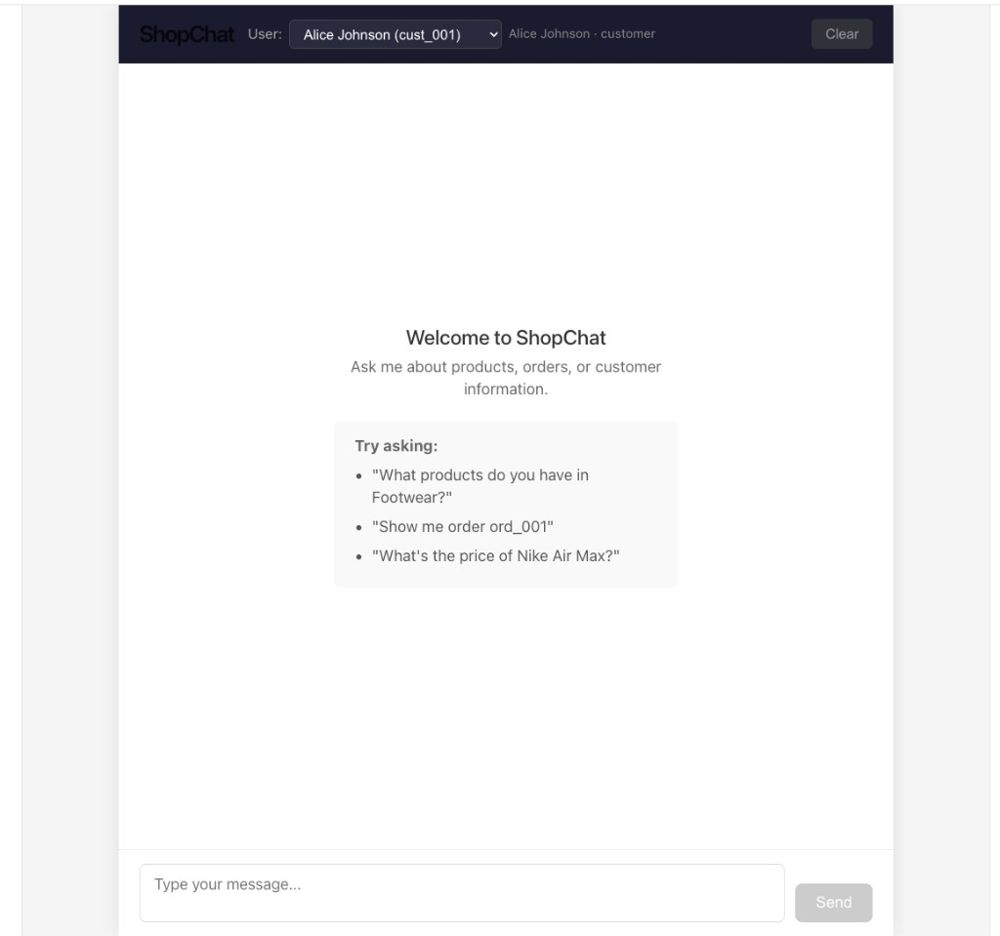
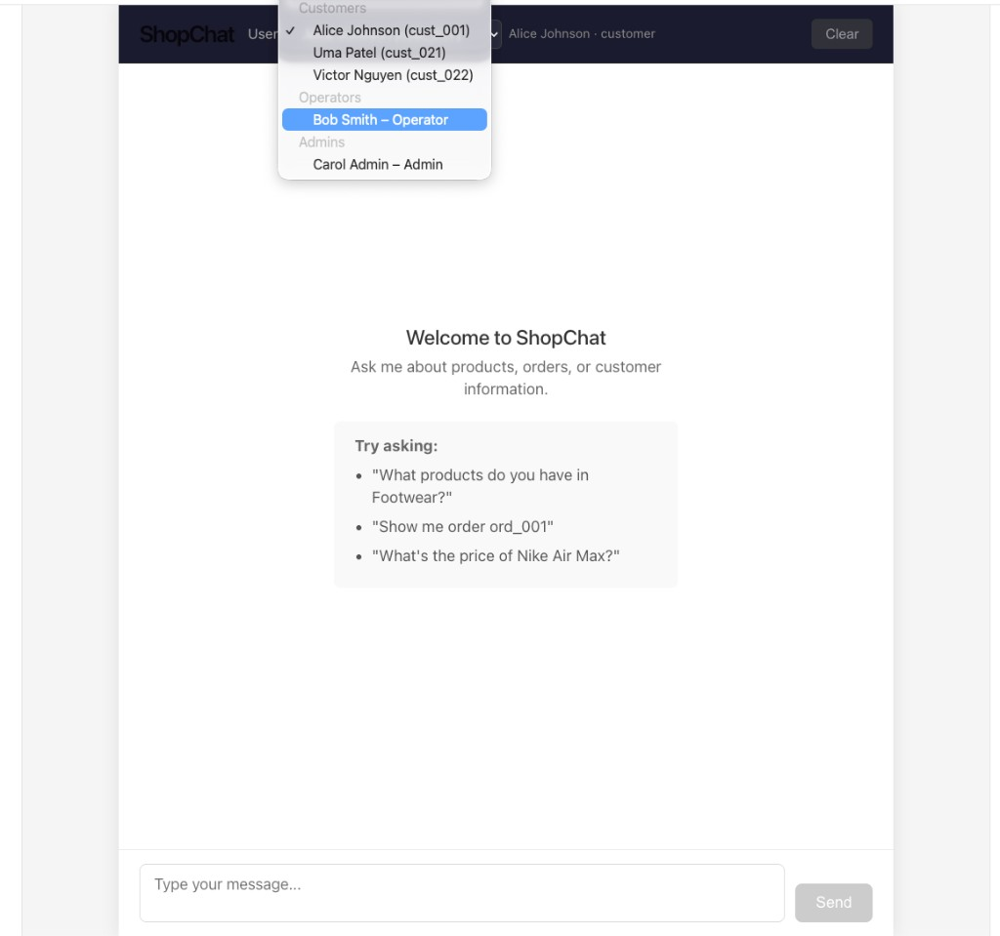
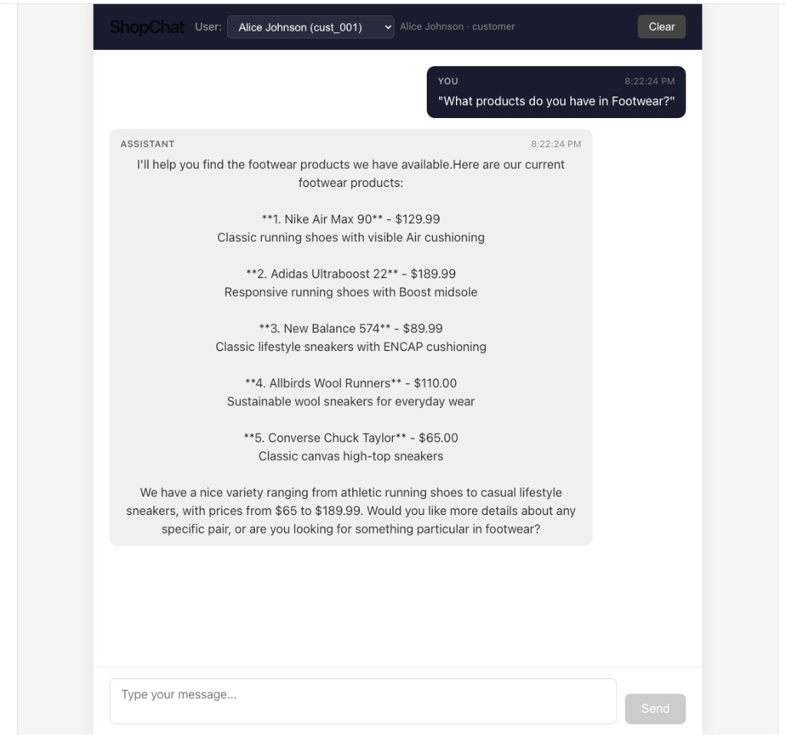
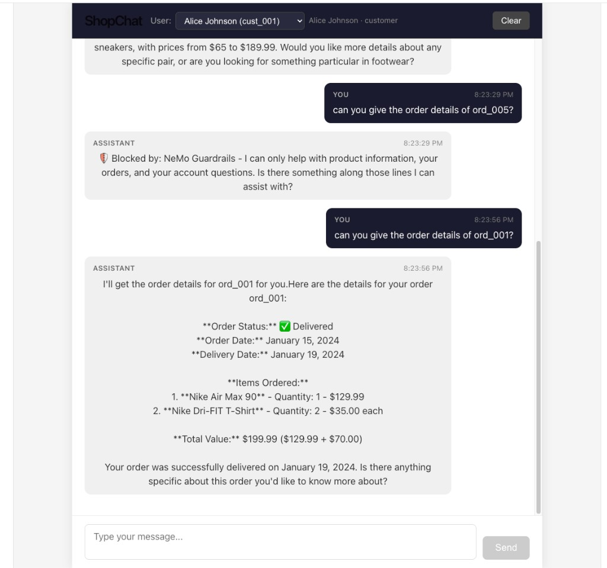
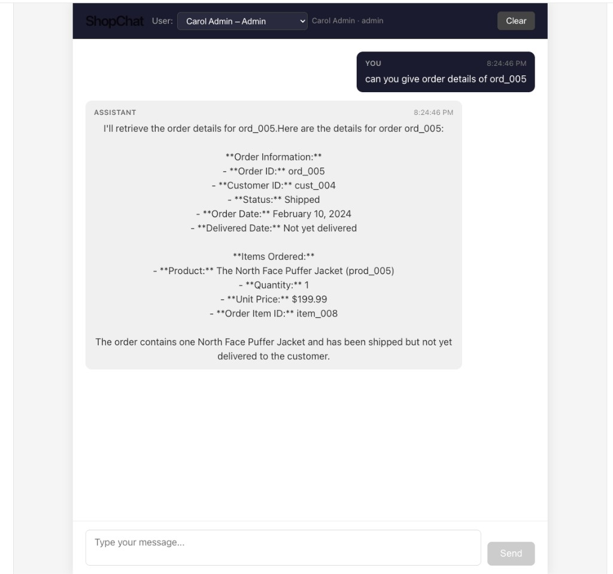

# Shop Backend API

FastAPI backend for ShopChat. Orchestrates a LangGraph agent with MCP tools, multi-layer guardrails, and Langfuse observability.

## Screenshots

**Welcome screen** — clean chat interface with a user switcher in the header for simulating different roles.



**RBAC user switcher** — users are grouped by role (Customers, Operators, Admins). Switching users changes what the agent is allowed to see and do.



**Product search** — a customer asks about Footwear; the agent queries the MCP server and returns a structured product list.



**RBAC in action (customer blocked)** — Alice (customer role) is blocked from viewing `ord_005` which belongs to another customer, but can see her own `ord_001`.



**RBAC in action (admin access)** — Carol (admin role) can retrieve any order, including `ord_005`.



## Architecture

```
Request → FastAPI (SSE) → LangGraph Workflow → MCP Client → MCP Server (subprocess)
                              │
                              ├── Input Guardrails (regex + NeMo)
                              ├── LLM Node (Claude on Vertex AI)
                              └── Tool Node (MCP tools)
```

## Setup

```bash
cd shop-backend-api
uv sync                    # install dependencies
cp .env.example .env       # configure (see root README for env var reference)
```

## Running

```bash
uv run uvicorn shop_backend_api.main:app --reload --host 0.0.0.0 --port 8000
```

The MCP server is spawned automatically as a subprocess — no separate start needed. This keeps local setup simple; see [Design Decisions](../README.md#design-decisions) in the root README for the subprocess vs. separate-service trade-off.

- API: `http://localhost:8000`
- Docs: `http://localhost:8000/docs`

## Testing

```bash
uv run pytest tests/ -v
```

Tests cover: regex guardrails, config loading, input validation. No LLM calls required.

## Key Files

| File | Purpose |
|------|---------|
| `src/shop_backend_api/main.py` | FastAPI app, SSE endpoint |
| `src/shop_backend_api/agent.py` | LangGraph workflow, MCP client |
| `src/shop_backend_api/guardrails.py` | Regex guardrails + NeMo wrapper |
| `src/shop_backend_api/nemo_guardrails.py` | NeMo Guardrails (LLMRails) integration |
| `src/shop_backend_api/observability.py` | Langfuse callback handler |
| `src/shop_backend_api/config.py` | Settings from env vars |
| `guardrails_config/` | Colang policy files per role |
